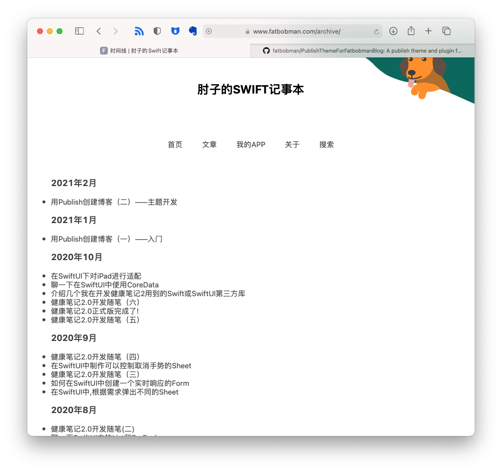

# PulbishArticleArchiveByMonth
A Plugin for Publish to generate a article archive page by month



add `makeDateArchive` after `addMarkdownFiles`

```swift
        .addMarkdownFiles(),
        .makeDateArchive(),
```

I wrote a blog to discuss how to write theme and plugin for Publish.
[My Blog](https://www.fatbobman.com/posts/publish-1/)
